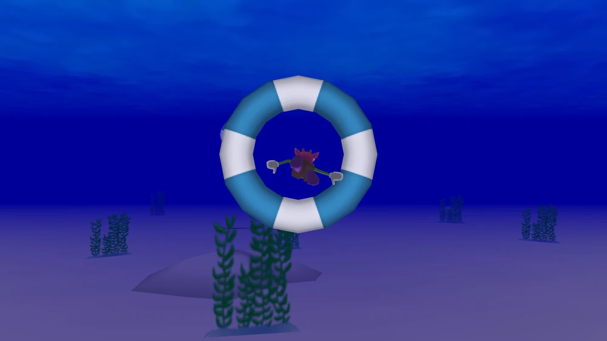

# Ocean Rings

The objective is to swim through the correct ring as depicted in the bottom right. Players move at a constant speed toward oncoming rings and the movement of the rings varies. If there is more than one player playing and all players get through their rings, a group bonus is given!

## Getting Started

First, run the development server:

```bash
npm run dev
```

## Multiplayer

Aiming to have multiplayer via P2P and Websockets. Websocket backend code is not in this repo or available at this time. P2P code will be included here.

## Inspiration
Inspired by the minigame inside Toontown

https://toontownrewritten.fandom.com/wiki/Ring_Game

